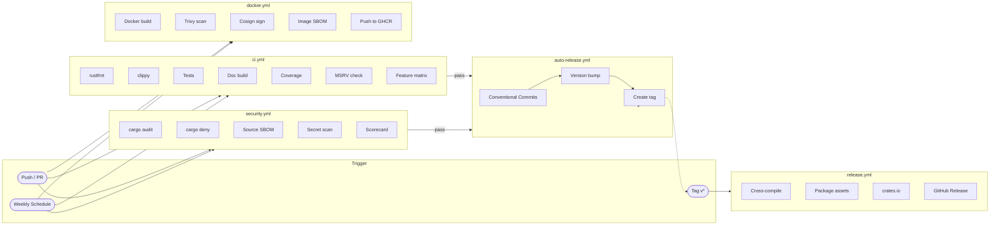

<div align="center">

# ThreatFlux Rust Project Template

[](https://github.com/ThreatFlux/rust-cicd-template/actions/workflows/ci.yml)
[](https://github.com/ThreatFlux/rust-cicd-template/actions/workflows/security.yml)
[](LICENSE)
[](https://www.rust-lang.org)
[](https://github.com/ThreatFlux/rust-cicd-template/releases)

**Production-ready scaffolding for Rust projects — CI/CD, security, packaging, and governance out of the box.**

[Quick Start](#quick-start) · [What's Included](#whats-included) · [Workflows](#workflows) · [Documentation](docs/)

</div>

---

A batteries-included template that encodes best practices for building, testing, securing, and shipping Rust applications. Uses **Rust 1.94.0** as the maintained baseline, defaults to the **Rust 2024 edition**, and supports both single-crate projects and multi-crate workspaces.

## Table of Contents

- [Quick Start](#quick-start)
- [What's Included](#whats-included)
- [How It Works](#how-it-works)
- [Single Crate vs Workspace](#single-crate-vs-workspace)
- [Workflows](#workflows)
- [Bootstrap Requirements](#bootstrap-requirements)
- [Configuration Reference](#configuration-reference)
- [Required Secrets](#required-secrets)
- [Makefile Targets](#makefile-targets)
- [Documentation](#documentation)
- [Contributing](#contributing)
- [Security](#security)
- [License](#license)

## Quick Start

### Generate a New Project

```bash
gh repo create my-project --template ThreatFlux/rust-cicd-template
cd my-project

# Replace template placeholders and verify.
make template-check

# Install local tooling and run full CI locally.
make dev-setup
make ci
```

After generating, replace `README.md` with `README_TEMPLATE.md`, then delete `README_TEMPLATE.md`. The `make template-check` target will fail until this handoff is complete.

### Copy Into an Existing Project

```bash
cp -r .github docs scripts .cargo \
  Makefile Dockerfile deny.toml \
  .editorconfig .pre-commit-config.yaml clippy.toml rustfmt.toml rust-toolchain.toml \
  /path/to/your/project/
```

<p align="right"><a href="#table-of-contents">back to top</a></p>

## What's Included

### CI & Quality

- Strict `rustfmt`, `clippy` (pedantic + nursery + cargo), doc tests, feature-combination checks, and MSRV validation
- Code coverage via `cargo-llvm-cov` with LCOV output
- Cross-platform test matrix (Linux, macOS, Windows)

### Security

- `cargo audit` and `cargo deny` for advisories, licenses, and supply-chain policy
- CycloneDX SBOM generation for both source and container images
- Secret scanning and OpenSSF Scorecard integration
- Pinned GitHub Actions by commit SHA to prevent upstream tampering

### Packaging & Release

- Multi-platform release binaries (Linux x86_64/aarch64, macOS universal, Windows x86_64)
- Docker build with Trivy scan, Cosign signing, and OCI image labels
- Automated release tagging driven by [Conventional Commits](https://www.conventionalcommits.org/)
- crates.io publishing support

### Project Governance

- `CODEOWNERS`, issue templates, PR template, contributing guide, security policy, and code of conduct
- `.editorconfig`, `rust-toolchain.toml`, `clippy.toml`, `rustfmt.toml`, and optional `pre-commit` hooks
- Bootstrap validation (`make template-check`) to catch unresolved placeholders before first merge

<p align="right"><a href="#table-of-contents">back to top</a></p>

## How It Works



<p align="right"><a href="#table-of-contents">back to top</a></p>

## Single Crate vs Workspace

The template ships as a single binary crate but the workflows and Makefile are parameterized to support either layout.

### Single-Crate Projects

- Keep `Cargo.toml` as the root package.
- Set `BINARY_NAME` in the `Makefile` if the binary name differs from the package name.

### Workspace Projects

Convert the root manifest to a workspace and set these repository variables (or Makefile overrides):

| Variable | Purpose |
|----------|---------|
| `RUST_TEMPLATE_BINARY_NAME` | CLI binary to package |
| `RUST_TEMPLATE_BINARY_PACKAGE` | Package that owns the binary |
| `RUST_TEMPLATE_PUBLISH_PACKAGES` | Publish order, space-separated |
| `RUST_TEMPLATE_SBOM_MANIFEST_PATH` | Manifest used for SBOM generation |

See [docs/TEMPLATE_BOOTSTRAP_CHECKLIST.md](docs/TEMPLATE_BOOTSTRAP_CHECKLIST.md) for the full setup checklist.

<p align="right"><a href="#table-of-contents">back to top</a></p>

## Workflows

| Workflow | Purpose | Trigger |
|----------|---------|---------|
| [`ci.yml`](.github/workflows/ci.yml) | Format, lint, test, docs, coverage, MSRV, feature checks | Push, PR, weekly |
| [`security.yml`](.github/workflows/security.yml) | Audit, deny, SBOM, secret scanning, Scorecard | Push, PR, weekly |
| [`release.yml`](.github/workflows/release.yml) | Build, package, publish, and attach release assets | Tags, manual |
| [`auto-release.yml`](.github/workflows/auto-release.yml) | Conventional-commit-driven release tagging | CI + Security pass |
| [`docker.yml`](.github/workflows/docker.yml) | Build, scan, sign, and SBOM container images | Push, PR, weekly |

<p align="right"><a href="#table-of-contents">back to top</a></p>

## Bootstrap Requirements

Before merging a generated repo, replace all template placeholders:

| Placeholder | Where |
|-------------|-------|
| Package name, binary name, description | `Cargo.toml` |
| Repository URLs and usernames | `README.md`, badges, clone examples |
| Code owners | `.github/CODEOWNERS` |
| Contact emails | `SECURITY.md` (if not using ThreatFlux defaults) |
| Starter description text | `README.md` |

Then validate:

```bash
make template-check   # Fails if placeholders remain
make ci               # Full local CI pass
```

<p align="right"><a href="#table-of-contents">back to top</a></p>

## Configuration Reference

### MSRV Locations

The minimum supported Rust version is declared in these files and must stay in sync:

| File | Field |
|------|-------|
| `Cargo.toml` | `rust-version` |
| `rust-toolchain.toml` | `channel` |
| `Makefile` | `RUST_MSRV` |
| `.github/workflows/ci.yml` | MSRV job matrix |
| `.github/workflows/release.yml` | Build toolchain |
| `.github/workflows/security.yml` | Toolchain pin |
| `Dockerfile` | `FROM rust:` tag |

### Makefile Overrides

| Variable | Default | Purpose |
|----------|---------|---------|
| `BINARY_NAME` | `rust-cicd-template` | Name of the compiled binary |
| `BINARY_PACKAGE` | _(empty)_ | Workspace package owning the binary |
| `SBOM_MANIFEST_PATH` | `Cargo.toml` | Manifest for SBOM generation |
| `PUBLISH_PACKAGES` | _(empty)_ | Ordered list of crates to publish |

### Docker Defaults

| Setting | Behavior |
|---------|----------|
| `DOCKER_REGISTRY` | Auto-derived from GitHub remote owner |
| OCI image labels | Neutral defaults; overridable via build args |

### Runner Variables

Defaults to GitHub-hosted runners. Set these only for custom runner labels:

`RUST_TEMPLATE_RUNNER_UBUNTU` · `RUST_TEMPLATE_RUNNER_MACOS` · `RUST_TEMPLATE_RUNNER_WINDOWS` · `RUST_TEMPLATE_RUNNER_MACOS_ARM64` · `RUST_TEMPLATE_RUNNER_MACOS_X64`

<p align="right"><a href="#table-of-contents">back to top</a></p>

## Required Secrets

| Secret | Purpose |
|--------|---------|
| `GITHUB_TOKEN` | Release assets, package publishing, container publishing |
| `CRATES_IO_TOKEN` or `CARGO_REGISTRY_TOKEN` | crates.io publishing |

<p align="right"><a href="#table-of-contents">back to top</a></p>

## Makefile Targets

```bash
make help             # Show all available targets
make dev-setup        # Install development tools
make template-check   # Validate bootstrap placeholders
make ci               # Full CI (fmt, lint, test, features, docs, security)
make ci-quick         # Quick CI (fmt, lint, check)
make build            # Debug build
make build-release    # Release build
make test             # Run all tests
make test-verbose     # Run tests with output
make test-doc         # Run doc tests
make test-features    # Test feature combinations
make fmt              # Format code
make lint             # Run clippy
make lint-strict      # Run clippy (pedantic + nursery + cargo)
make coverage         # Generate LCOV coverage report
make coverage-html    # Generate HTML coverage report
make audit            # Security advisory check
make deny             # License and supply-chain check
make sbom             # Generate CycloneDX SBOM
make docker-build     # Build Docker image
make docs             # Build rustdoc
make msrv             # Verify minimum supported Rust version
make clean            # Remove build artifacts
```

<p align="right"><a href="#table-of-contents">back to top</a></p>

## Documentation

This template ships a complete `docs/` directory that generated projects should adopt. Each document includes a comment block at the top explaining what makes a good version of that file.

| Document | Purpose |
|----------|---------|
| [docs/README.md](docs/README.md) | Documentation index and naming conventions |
| [docs/README_STANDARDS.md](docs/README_STANDARDS.md) | README style guide — badges, TOC, diagrams, anti-patterns |
| [docs/ARCHITECTURE.md](docs/ARCHITECTURE.md) | High-level codemap and design decisions |
| [docs/CHANGELOG.md](docs/CHANGELOG.md) | Version history (Keep a Changelog format) |
| [docs/RELEASING.md](docs/RELEASING.md) | Maintainer release runbook |
| [docs/FAQ.md](docs/FAQ.md) | Common setup and customization questions |
| [docs/TEMPLATE_BOOTSTRAP_CHECKLIST.md](docs/TEMPLATE_BOOTSTRAP_CHECKLIST.md) | Post-generation setup checklist |

The starter README for generated projects lives in [README_TEMPLATE.md](README_TEMPLATE.md).

<p align="right"><a href="#table-of-contents">back to top</a></p>

## Contributing

Contributions are welcome. See [CONTRIBUTING.md](CONTRIBUTING.md) for development setup, commit conventions, and PR guidelines.

## Security

See [SECURITY.md](SECURITY.md) for vulnerability reporting instructions.

## License

This project is licensed under the [MIT License](LICENSE).

---

<div align="center">

Built and maintained by [ThreatFlux](https://github.com/ThreatFlux)

</div>
