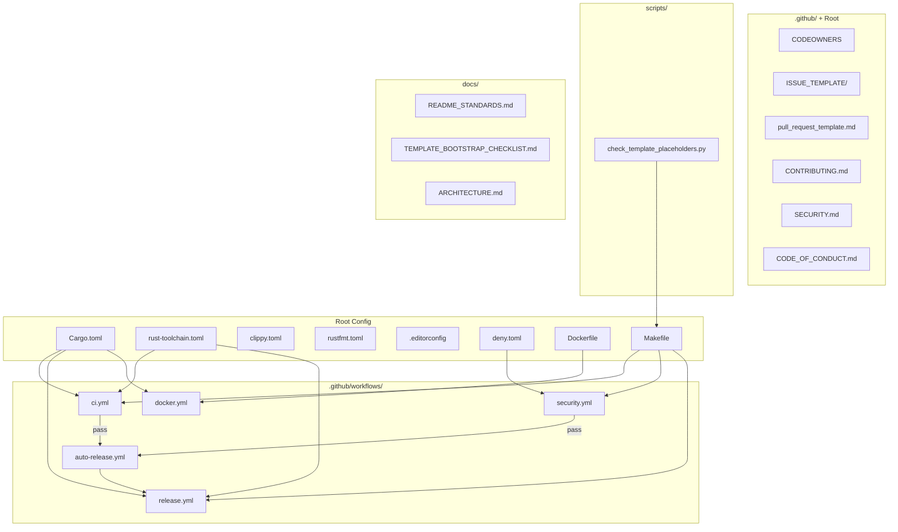

# Architecture

<!--
  ARCHITECTURE.md — What makes this document good:

  This file is a high-level codemap for contributors and maintainers. It answers
  "where is the code that does X?" and "what are the boundaries between modules?"
  without duplicating inline code comments.

  Best practices:
  - Lead with a one-paragraph overview of the system's purpose and shape.
  - Use a diagram (Mermaid preferred) showing major components and data flow.
  - Organize by module/crate, not by file — group by responsibility.
  - For each component, state: what it does, what it owns, what it depends on.
  - Call out key invariants and non-obvious design decisions with "Why:" notes.
  - Keep this document under ~300 lines. Link to code rather than quoting it.
  - Update when module boundaries change, not on every commit.
  - Inspired by https://matklad.github.io/2021/02/06/ARCHITECTURE.md.html

  Standard name: ARCHITECTURE.md (root or docs/)
  When to include: Any project with more than one module or crate.
-->

## Overview

This repository is a GitHub template that generates production-ready Rust projects. It contains no runtime library code — its "architecture" is the set of interconnected configuration files, workflows, and scripts that together form the project scaffolding.

## Component Map

## Key Design Decisions

**Why commit-SHA pinning for Actions?** Supply-chain attacks on GitHub Actions are a real and growing vector. Pinning by SHA (not tag) prevents upstream tag mutation from silently changing what runs in CI.

**Why a single Makefile instead of a task runner?** Make is universally available, requires no installation, and provides a consistent interface whether a developer runs locally or CI runs in a container. The Makefile is parameterized with variables so it works for both single-crate and workspace layouts without forking.

**Why `cargo-deny` alongside `cargo audit`?** `cargo audit` checks the RustSec advisory database. `cargo-deny` adds license policy, duplicate dependency detection, and source restrictions. Together they cover both security and compliance.

**Why separate `ci.yml` and `security.yml`?** Security checks (audit, deny, SBOM, Scorecard) have different failure semantics than build/test. Separating them allows security failures to block release without blocking development iteration.
